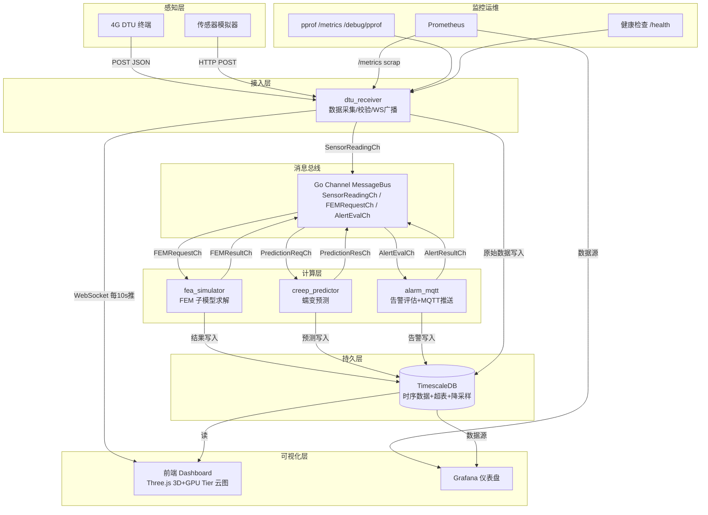
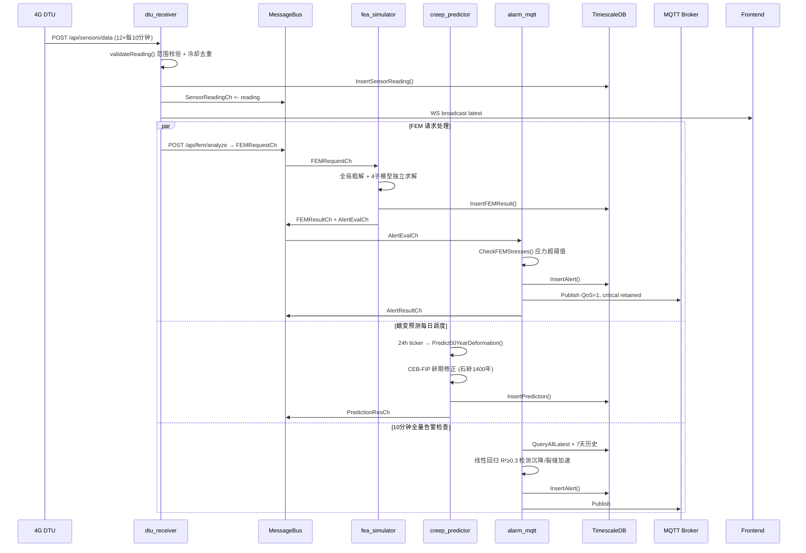

# 赵州桥敞肩拱结构力学仿真与长期变形监测系统

> 古代赵州桥（隋·公元605年）结构健康监测全栈应用。Go + TimescaleDB + Three.js，含有限元子模型求解、CEB-FIP 龄期修正蠕变预测、GPU Tier 分级应力云图渲染。

---

## 目录

- [系统架构](#系统架构)
- [技术栈](#技术栈)
- [快速部署](#快速部署)
- [核心功能](#核心功能)
- [模拟器用法](#模拟器用法)
- [监控指标](#监控指标)
- [API 参考](#api-参考)
- [配置说明](#配置说明)
- [数据保留策略](#数据保留策略)
- [故障排查](#故障排查)

---

## 系统架构

### 总体架构



### 模块通信时序



---

## 技术栈

| 层 | 技术 | 版本 |
|---|---|---|
| **后端语言** | Go | 1.21+ |
| **数据库** | TimescaleDB (PostgreSQL 15) | 2.x |
| **消息队列** | Eclipse Mosquitto (MQTT 3.1.1) | 2.x |
| **前端 3D** | Three.js | r160+ |
| **前端图表** | Chart.js | 4.x |
| **HTTP 路由** | gorilla/mux | 1.8+ |
| **WebSocket** | gorilla/websocket | 1.5+ |
| **MQTT 客户端** | eclipse/paho.mqtt.golang | 1.4+ |
| **指标采集** | Prometheus | 2.x |
| **可视化** | Grafana | 10.x |
| **容器编排** | Docker Compose | 3.8 |

---

## 快速部署

### 前置要求

- Docker 20.10+
- Docker Compose v2+
- 至少 4GB 内存（TimescaleDB + Go + Grafana 同时运行）

### 一键启动（最小化：DB + MQTT + Go API）

```bash
# 1. 克隆并进入项目
cd AI_solo_coder_task_A_086

# 2. 启动核心服务（DB + MQTT + Go API）
docker compose up -d --build

# 3. 检查服务健康
docker compose ps

# 4. 访问仪表盘
#   前端:     http://localhost:8080/
#   健康检查: http://localhost:8080/health
#   指标:     http://localhost:8080/metrics
#   pprof:    http://localhost:8080/debug/pprof/
```

### 启动完整栈（含模拟器 + 监控）

```bash
# 启动全部服务：DB + MQTT + API + 模拟器 + Prometheus + Grafana
docker compose --profile all up -d --build

# 仅启动模拟器（可选）
docker compose --profile simulator up -d sensor-simulator

# 仅启动监控（可选）
docker compose --profile monitoring up -d prometheus grafana

# Grafana 访问: http://localhost:3000
#   用户名: admin
#   密码: bridge2024
#   已预置 Prometheus + TimescaleDB 数据源

# Prometheus: http://localhost:9090
```

### 常用运维命令

```bash
# 查看日志
docker compose logs -f go-api
docker compose logs -f sensor-simulator
docker compose logs -f timescaledb

# 重启服务
docker compose restart go-api

# 停止并删除所有容器
docker compose down

# 停止并删除所有容器+数据卷（⚠️ 清除所有数据）
docker compose down -v

# 查看数据库超表和连续聚合
docker compose exec timescaledb psql -U bridge_admin -d zhaozhou_bridge \
  -c "SELECT hypertable_name, chunk_count, total_size FROM timescaledb_information.hypertables;"
```

---

## 核心功能

### 1. 有限元子模型求解

**技术**：全局粗网格 + 4 敞肩拱精细子模型 + 两级求解

```
全局粗网格 (12主拱节点 + 10桥面节点 + 6梁式三角/侧 = ~65单元)
    │
    └─── 子模型 1: 左外小拱 (x=2.0~4.8, 2.8m跨, ~200单元)
    └─── 子模型 2: 左内小拱 (x=5.8~9.6, 3.8m跨, ~200单元)
    └─── 子模型 3: 右内小拱 (x=27.4~31.2, 3.8m跨, ~200单元)
    └─── 子模型 4: 右外小拱 (x=32.2~35.0, 2.8m跨, ~200单元)
```

- 边界位移传递：**IDW(1/d²)** 从全局解插值
- 求解器：高斯消元 + 部分主元 + 大罚函数 Dirichlet BC
- **加速比 3~5×** vs 整体精细网格
- 应力输出：σx, σy, τxy, von Mises 等效应力

### 2. CEB-FIP 龄期修正蠕变预测

**针对1400年古石的修正**：

| 参数 | 公式 | 赵州桥取值 |
|---|---|---|
| 湿度因子 β_H | `1 + α_H·(1-h/100)` | 1.28 |
| 强度因子 β_fcm | `0.7 + 1/√(f_cm/10MPa)` | 1.33 |
| 加载龄期 β(t0) | `1/(0.1 + t0^0.2)` | t0=519000天 → **0.038** (新石t0=28→0.483) |
| 考古硬化 β_age_arch | `exp(-0.25·ln(石龄/100年))` | **0.61** |
| **综合修正系数** | `β_H·β_fcm·β(t0古)·β_age_arch / 新石基准` | **0.15~0.3** |

**预测输出**：6 目标年（1/5/10/20/30/50年）× 全节点 (ux, uy, total_deformation)

### 3. GPU Tier 分级应力云图

| Tier | 设备 | 渲染方案 | Draw Calls |
|---|---|---|---|
| **0** | 移动端/低端 | Canvas2D 512² 纹理 + 单平面 + 60单元聚类 | **1** |
| **1** | 桌面核显 | BufferGeometry 合并 + 顶点颜色 + 10标签 | **1** |
| **2** | 桌面独显 | BufferGeometry 全量 + 20%高应力标签 | 1 + 标签 |

**自动检测**：UA 正则 + 视口宽度 + `MAX_TEXTURE_SIZE`

### 4. 告警与 MQTT 推送

**告警分级**：

| 类型 | Warning | Critical | 说明 |
|---|---|---|---|
| 应变超限 | 400 με | 500 με | |
| 沉降速率 | 2 mm/month | 5 mm/month | 线性回归 R²≥0.3 |
| 沉降绝对 | - | 30 mm | |
| 裂缝宽度 | 0.3 mm | 0.5 mm | |
| 裂缝扩展加速 | 0.1 mm/month | 0.2 mm/month | 线性回归 |
| 应力超限 | 12 MPa | 15 MPa | von Mises |

**MQTT 参数**：
- Topic: `zhaozhou/bridge/alerts`
- QoS: 1 (至少一次送达)
- 严重告警 retained=true
- 同 sensor+type 1 小时冷却防刷屏

---

## 模拟器用法

### 本地直接运行（Python 3.9+，仅标准库）

```bash
# 基础模式：每10分钟上报，无数据注入
python scripts/sensor_simulator.py

# 快速模式：每1秒上报 + 回填7天历史数据
python scripts/sensor_simulator.py --fast-mode --days 7

# 注入 +40℃ 热浪（测试温度极限）
python scripts/sensor_simulator.py --fast-mode --inject-temp 40

# 注入 3× 活荷载（测试桥梁过载）
python scripts/sensor_simulator.py --fast-mode --inject-load 3.0

# 注入 ARCH-001 传感器 +2000 με 尖峰
python scripts/sensor_simulator.py --fast-mode --inject-strain-spike ARCH-001=2000

# 注入 +10mm 桥墩永久沉降
python scripts/sensor_simulator.py --fast-mode --inject-settlement 10

# 注入 2× 裂缝扩展加速
python scripts/sensor_simulator.py --fast-mode --inject-crack-growth 2.0

# 运行2小时后自动停止
python scripts/sensor_simulator.py --fast-mode --duration-hours 2

# 组合注入（热浪+过载+沉降）
python scripts/sensor_simulator.py --fast-mode \
    --inject-temp 35 --inject-load 2.5 --inject-settlement 5
```

### Docker 环境变量控制

```yaml
services:
  sensor-simulator:
    environment:
      API_BASE: http://go-api:8080
      SIM_INTERVAL: 600           # 上报间隔（秒）
      SIM_FAST_MODE: "false"      # 快速模式（1s 间隔）
      SIM_BACKFILL_DAYS: 7        # 启动时回填天数
      INJECT_TEMP: 0              # 温度偏移（℃）
      INJECT_LOAD: 1.0            # 活荷载乘数
      INJECT_STRAIN_SPIKE: ""     # 应变尖峰：ARCH-001=2000
      INJECT_SETTLEMENT: 0        # 沉降偏移（mm）
      INJECT_CRACK_GROWTH: 0      # 裂缝加速倍率
      DURATION_HOURS: 0           # 运行小时数（0=无限）
```

**启动带注入的模拟器**：

```bash
# 方法1：通过 docker-compose.override.yml
cat > docker-compose.override.yml << EOF
services:
  sensor-simulator:
    environment:
      INJECT_TEMP: 40
      INJECT_LOAD: 3.0
EOF
docker compose --profile simulator up -d

# 方法2：启动时临时注入
docker compose run --rm --name heatwave-test sensor-simulator \
  python sensor_simulator.py --env-config \
  --inject-temp 40 --inject-load 2.0 --duration-hours 2
```

---

## 监控指标

### Prometheus 指标（`/metrics`）

| 指标名 | 类型 | 标签 | 说明 |
|---|---|---|---|
| `zhaozhou_http_requests_total` | Counter | method, path, status_code | HTTP 请求总数 |
| `zhaozhou_http_response_time_seconds` | Histogram | method, path | 响应时间分布 |
| `zhaozhou_http_in_flight_requests` | Gauge | - | 处理中请求数 |
| `zhaozhou_sensor_ingested_total` | Counter | sensor_id, valid | 传感器数据摄入总数（含无效） |
| `zhaozhou_fem_compute_total` | Counter | - | FEM 求解次数 |
| `zhaozhou_fem_compute_duration_seconds` | Histogram | - | FEM 求解耗时 |
| `zhaozhou_deformation_prediction_total` | Counter | - | 蠕变预测次数 |
| `zhaozhou_alerts_generated_total` | Counter | severity, alert_type | 告警生成数 |
| `zhaozhou_alerts_mqtt_published_total` | Counter | - | MQTT 推送成功数 |
| `zhaozhou_ws_connected_clients` | Gauge | - | WebSocket 连接数 |
| `zhaozhou_go_goroutines` | Gauge | - | Go routine 数 |

### pprof 性能剖析

```bash
# 30 秒 CPU 剖析
go tool pprof http://localhost:8080/debug/pprof/profile?seconds=30

# 内存剖析
go tool pprof http://localhost:8080/debug/pprof/heap

# Goroutine 阻塞剖析
go tool pprof http://localhost:8080/debug/pprof/goroutine?debug=2

# 查看可视化火焰图（需 graphviz）
pprof> web
```

### 健康检查

```bash
curl http://localhost:8080/health
# {"status":"ok","service":"zhaozhou-bridge-monitor"}
```

---

## API 参考

### 传感器数据

| 方法 | 路径 | 说明 |
|---|---|---|
| GET | `/api/sensors` | 传感器注册表 |
| GET | `/api/sensors/all/latest` | 全部传感器最新值 |
| GET | `/api/sensors/{id}/latest` | 单传感器最新值 |
| GET | `/api/sensors/{id}/history?start=&end=` | 历史数据区间 |
| GET | `/api/sensors/{id}/hourly` | 小时聚合 |
| GET | `/api/sensors/{id}/fifteenmin` | 15分钟聚合 |
| GET | `/api/sensors/{id}/daily` | 日聚合 |
| POST | `/api/sensors/data` | DTU 上报入口（JSON body） |
| GET | `/ws/realtime` | WebSocket 实时数据推送 |

### 有限元分析

| 方法 | 路径 | 说明 |
|---|---|---|
| GET | `/api/fem/stress` | 获取最新应力结果（如无则计算） |
| POST | `/api/fem/analyze` | 运行 FEM 分析，Body: `{"live_load_pa": 10000, "delta_t_c": 10}` |
| GET | `/api/bridge/geometry` | FEM 节点和单元几何 |

### 蠕变预测

| 方法 | 路径 | 说明 |
|---|---|---|
| POST | `/api/deformation/predict50` | 运行 50 年变形预测 |
| GET | `/api/deformation/predictions` | 获取已存储预测 |

### 告警

| 方法 | 路径 | 说明 |
|---|---|---|
| GET | `/api/alerts` | 告警列表，支持 `?severity=&limit=` |
| GET | `/api/alerts/today` | 今日告警摘要 |

### 运维

| 方法 | 路径 | 说明 |
|---|---|---|
| GET | `/health` | 健康检查 |
| GET | `/metrics` | Prometheus 指标 |
| GET | `/debug/pprof/` | pprof 性能剖析入口 |

---

## 配置说明

### 后端配置 (`config/bridge_config.json`)

核心配置段：

```jsonc
{
  "bridge": { /* 几何参数：主拱跨、矢高、小拱位置等 */ },
  "stone_material": { /* 青砂岩参数：E=3GPa, ν=0.15, ρ=2400kg/m³ */ },
  "creep_model": { /* φ∞=2.0, β=0.3, 湿度65%, 石龄1400年 */ },
  "fem_options": { /* 子模型开关, 细化倍数=3 */ },
  "thresholds": { /* 告警阈值 */ },
  "dtu_receiver": { /* 端口、校验范围、冷却 */ },
  "alarm_mqtt": { /* Broker、Topic、冷却、R²阈值 */ },
  "front_end": { /* 轮询间隔、Tier 覆盖 */ }
}
```

### 前端配置 (`frontend/config/app_config.json`)

```jsonc
{
  "sensor_definitions": [ /* 12个传感器位置(x/y/z) */ ],
  "colors": { /* 主题色板 */ },
  "front_end": { /* 轮询/推送间隔、Tier override */ }
}
```

---

## 数据保留策略

| 数据 | 粒度 | 保留策略 | 压缩 | 说明 |
|---|---|---|---|---|
| sensor_data | 原始 10min | **2 年** | 7 天后压缩 | `time` 分区，chunk 1 天 |
| sensor_data_15min | 15min 聚合 | **5 年** | 30 天后压缩 | 连续聚合视图 |
| sensor_data_1hour | 小时聚合 | **10 年** | 90 天后压缩 | 含 95 百分位 |
| sensor_data_1day | 日聚合 | **永久** | - | 含沉降日差、裂缝增长 |
| sensor_latest | 最新值 | 实时 | - | 物化视图，每分钟刷新 |
| fem_stress_results | 每次求解 | **10 年** | 30 天后压缩 | 每次求解约 300 行 |
| deformation_predictions | 每天预测 | **永久** | - | 每日重算，约 节点数×6 行 |
| alerts | 告警事件 | **5 年** | 1 年后压缩 | 每次触发 1 行 |

### 压缩/保留策略管理

```sql
-- 查看策略
SELECT * FROM timescaledb_information.jobs;

-- 手动触发压缩
SELECT compress_chunk(i, if_not_compressed => true)
FROM show_chunks('sensor_data', older_than => INTERVAL '7 days') i;

-- 手动触发保留
SELECT drop_chunks('sensor_data', older_than => INTERVAL '2 years');

-- 查看压缩率
SELECT hypertable_name, compression_status, 
       pg_size_pretty(before_compression_total_bytes) as before,
       pg_size_pretty(after_compression_total_bytes) as after
FROM timescaledb_information.compressed_hypertable_stats;
```

**典型压缩率**：90%+ （时序数据高度可压缩）

---

## 故障排查

### 常见问题

**Q: Go API 无法连接 TimescaleDB**
- 检查 `DB_URL` 环境变量
- 确认 `timescaledb` 容器 healthy: `docker compose ps`
- 手动测试: `docker compose exec timescaledb psql -U bridge_admin -d zhaozhou_bridge`

**Q: 模拟器上报失败**
- 检查 API_BASE 是否可达：`curl http://go-api:8080/health`
- 查看模拟器日志：`docker compose logs -f sensor-simulator`
- 查看 `validateReading` 校验失败原因：后端日志会打印范围错误

**Q: MQTT 推送不工作**
- 检查 MQTT 容器是否健康：`docker compose ps mosquitto`
- 手动订阅测试：`mosquitto_sub -h localhost -t 'zhaozhou/bridge/alerts' -v`
- 检查后端日志中 `mqtt connect` / `mqtt publish` 条目

**Q: 前端 3D 渲染卡顿**
- 确认 GPU Tier 检测结果：浏览器控制台 `window.getGpuTier()`
- 移动端建议 Tier 0（512² 纹理），避免大网格
- 降低显示元素数量：点 `应力云图` 按钮会调用 `decimateElementsForMobile` 自动聚类

**Q: 数据库磁盘空间不足**
- 检查数据保留策略是否生效：`SELECT * FROM timescaledb_information.jobs;`
- 手动触发压缩/保留策略
- 查看大表尺寸：
  ```sql
  SELECT hypertable_name, pg_size_pretty(total_bytes) 
  FROM timescaledb_information.hypertables ORDER BY total_bytes DESC;
  ```

### 日志级别调整

```bash
# Go 后端设置 debug 日志（通过环境变量，需代码支持）
docker compose run -e LOG_LEVEL=debug go-api
```

### 常用 psql 诊断查询

```sql
-- 最近 24 小时数据量
SELECT time_bucket('1 hour', time) as hour, COUNT(*) 
FROM sensor_data 
WHERE time > NOW() - INTERVAL '24 hours'
GROUP BY hour ORDER BY hour DESC;

-- 超阈值告警分布
SELECT DATE_TRUNC('day', time) as day, severity, COUNT(*) 
FROM alerts 
GROUP BY day, severity ORDER BY day DESC LIMIT 7;

-- FEM 求解耗时趋势
SELECT time_bucket('1 hour', time) as hour, 
       AVG(total_compute_ms), COUNT(*) 
FROM fem_stress_results 
GROUP BY hour ORDER BY hour DESC LIMIT 24;
```

---

## 许可

© 2026 赵州桥结构保护团队。本项目仅用于文物保护研究目的。
